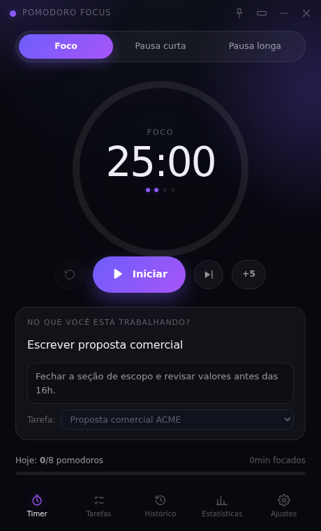
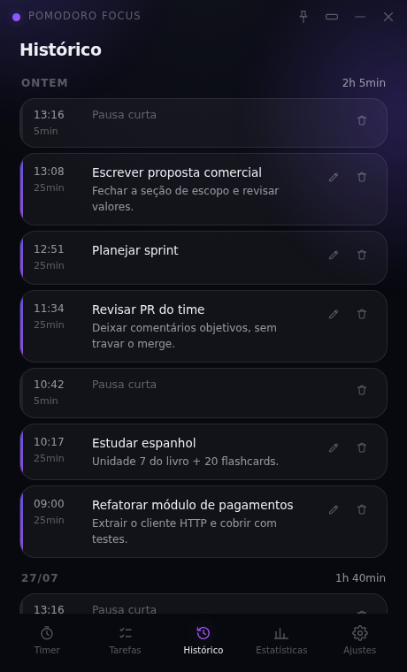
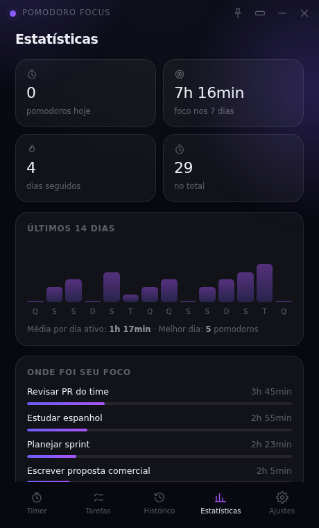

# Pomodoro Focus

Um aplicativo Pomodoro para desktop (Windows, com build também para Linux e macOS)
feito para uma coisa só: **você trabalhar 25 minutos sem ser interrompido** — e saber
depois no que esse tempo foi gasto.

Cada sessão de foco tem **nome e descrição**. O histórico deixa de ser uma pilha de
tomates contados e vira um registro do que você realmente fez.

<p align="center">
  
  
  
</p>

## O que ele faz

**A técnica Pomodoro completa**

- Foco, pausa curta e pausa longa, com durações configuráveis (padrão 25 / 5 / 15).
- Pausa longa automática a cada N sessões de foco (padrão 4), com os pontinhos do
  ciclo abaixo do relógio.
- Início automático de pausas e/ou do próximo foco, se você quiser o fluxo contínuo.
- Pausar, retomar, reiniciar a etapa, pular a etapa e esticar +5 minutos.
- Relógio ancorado no horário real: não atrasa em segundo plano nem depois de
  suspender o computador, e uma sessão em andamento é retomada se você fechar e
  reabrir o app.

**Nomear e descrever cada sessão** (o coração do app)

- Campo "No que você está trabalhando?" antes de dar play, com sugestões dos nomes
  já usados.
- Descrição opcional para o objetivo, o próximo passo ou o que precisa ficar pronto.
- Nome e descrição ficam gravados na sessão e podem ser editados depois, no histórico.
- Opção "pedir o nome da sessão", que impede começar um foco sem dizer no que vai
  trabalhar.

**Tarefas, histórico e números**

- Lista de tarefas com descrição e estimativa de pomodoros; ao focar em uma tarefa,
  nome e descrição já entram na sessão e o contador dela sobe sozinho.
- Histórico agrupado por dia, com horário, duração e o que foi feito. Sessões
  interrompidas aparecem marcadas — sem julgamento, só registro.
- Estatísticas: pomodoros de hoje, foco dos últimos 7 dias, sequência de dias,
  total, gráfico de 14 dias e um resumo de **onde o seu foco foi parar**, agrupado
  pelo nome das sessões.

**Sem distrações**

- Janela sem barra de título do sistema, fundo escuro e uma única coisa em destaque:
  o tempo restante.
- Durante o foco a interface escurece e só o relógio permanece; passe o mouse e ela
  volta.
- Modo compacto: uma pílula de 340×150 que fica sempre à frente, com o relógio, o
  nome da sessão e dois botões.
- Bandeja do sistema com controles, notificação nativa no fim de cada etapa e a
  barra de progresso do Windows na própria barra de tarefas.
- Sons sintetizados (sinos suaves, tique-taque opcional) — sem estridência.
- Quatro temas: Meia-noite, Aurora, Brasa e Papel (claro).

**Seus dados são seus**

Tudo fica em um arquivo JSON dentro da pasta do usuário
(`%APPDATA%\Pomodoro Focus\pomodoro-data.json` no Windows). O app não faz nenhuma
requisição de rede — não há conta, telemetria ou sincronização.

## Atalhos

| Tecla | Ação |
| --- | --- |
| `Espaço` | Iniciar / pausar |
| `R` | Reiniciar a etapa |
| `S` | Pular a etapa |
| `M` | Alternar o modo compacto |
| `1` `2` `3` | Foco, pausa curta, pausa longa |

## Instalação (Windows)

Baixe na página de [Releases](../../releases):

- `PomodoroFocus-Setup-<versão>.exe` — instalador (atalho no menu Iniciar e na área
  de trabalho).
- `PomodoroFocus-Portable-<versão>.exe` — versão portátil, sem instalação.

O executável não é assinado digitalmente, então o SmartScreen pode pedir
"Mais informações → Executar assim mesmo" na primeira vez.

## Desenvolvimento

Requisitos: Node.js 20+.

```bash
npm install
npm run dev          # Vite + Electron em modo de desenvolvimento
```

| Script | O que faz |
| --- | --- |
| `npm run dev` | Sobe o app em desenvolvimento (F12 abre o DevTools) |
| `npm run build` | Compila o processo principal, o preload e a interface |
| `npm run build:prod` | Gera os ícones e compila tudo |
| `npm run dist:win` | Instalador + portátil para Windows em `release/` |
| `npm run test:unit` | Testes unitários (Vitest) |
| `npm run typecheck` | TypeScript em modo estrito |
| `npm run lint` | ESLint |

Detalhes de empacotamento e publicação estão em [BUILD.md](BUILD.md).

## Arquitetura

```
src/
  shared/      Domínio puro e testável: tipos, regras do Pomodoro, estatísticas,
               formatação. Sem Electron, sem DOM.
  main/        Processo principal: janela, bandeja, notificações, IPC e o store
               JSON (escrita atômica com backup).
  preload/     Ponte de contexto isolado: expõe uma API pequena e tipada.
  renderer/    Interface em React: o motor do timer (useTimer), as telas e o CSS.
```

Algumas decisões que valem o comentário:

- **O tempo vem do relógio da parede.** O timer guarda um *deadline* e recalcula
  o que falta a cada 250 ms, então ele não acumula atraso nem depende do
  `setInterval` ser pontual.
- **O contexto do renderer é isolado** (`contextIsolation: true`,
  `nodeIntegration: false`) e o preload expõe apenas dez funções.
- **Os sons são sintetizados** com a Web Audio API — nada de arquivos de áudio
  para carregar (ou faltar) dentro do pacote.
- **A interface funciona no navegador** também: sem Electron, o app cai para
  `localStorage`, o que torna o desenvolvimento e os testes visuais bem mais rápidos.

## Testes

```bash
npm run test:unit
```

Os testes cobrem a camada `src/shared`: a máquina de estados do Pomodoro
(incluindo a pausa longa e o caso da sessão pulada), a restauração do timer após
fechar o app, as estatísticas (hoje, semana, sequência, agrupamento por nome) e a
formatação.

## Licença

MIT — veja [LICENSE](LICENSE).
